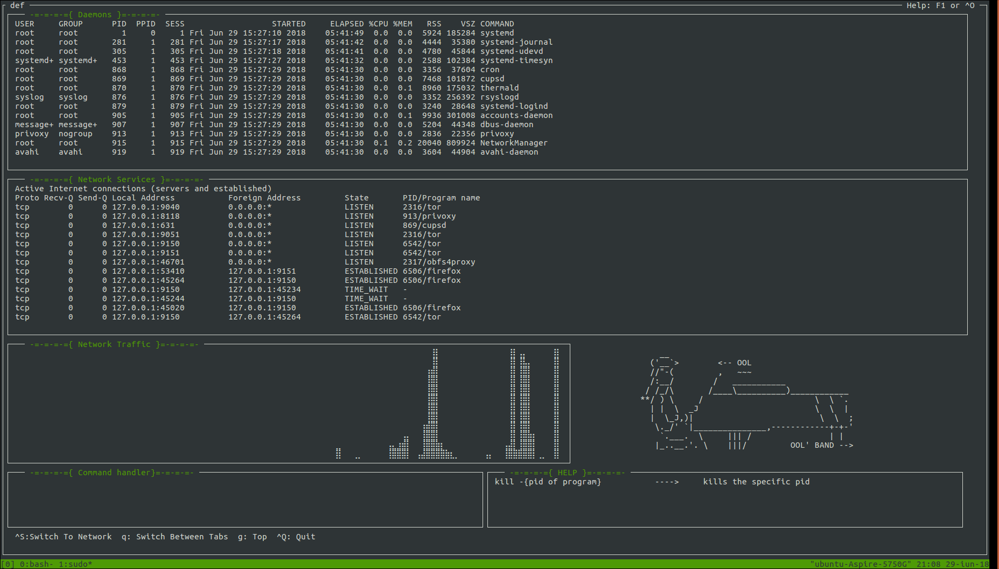
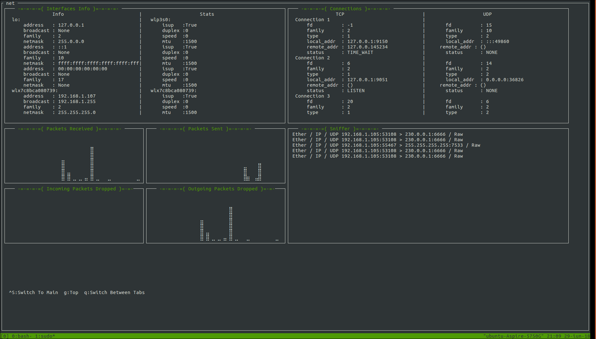
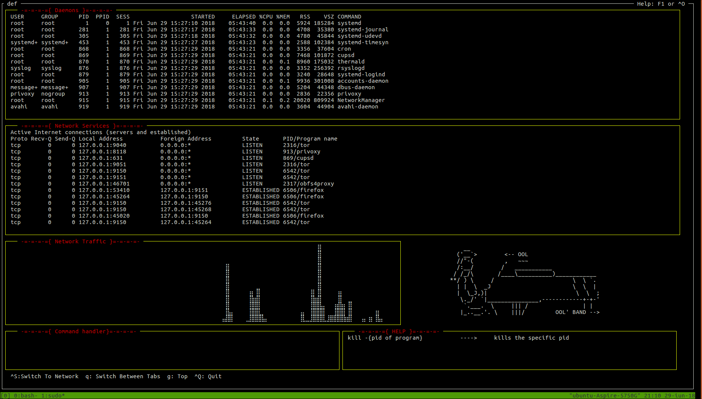
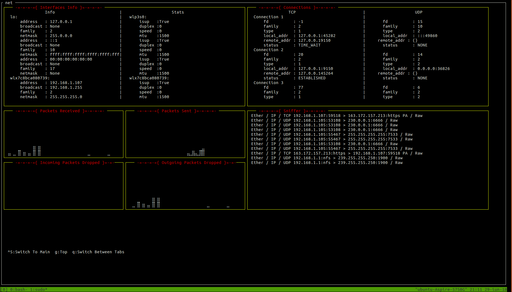

# NADS
A monitoring app for open ports, network traffic, daemons, connections and much more.

> **NOTE !!**: This repository is an old one & is no longer mantained

## Installing & Usage
You just need to clone the repository and make Nads.py executable: ```chmod +x Nads.py```.<br />
**Note:** Looking forward to make possible installing it through pip.<br />
<br />
Once you have the repository cloned, you just need to run the app with root priviliges, since it is accesing data that only the root user can: ```sudo python Nads.py -i <interface>```.<br />
As you can see, the app needs the interface for monitoring.<br />
You can also choose a theme with the _**-t**_ flag, from the suppoerted themes: 
- **Elegant**
- **Colorful**
- **Simple**
- **Dark**
- **Light**
- **Blackonwhite**

## Some Screenshots
<br />
<br />
<br />
<br />
## Dependecies
- [npyscreen](https://npyscreen.readthedocs.io/introduction.html)
- [scapy](https://scapy.readthedocs.io/en/latest/)
- [drawille](https://github.com/asciimoo/drawille)
- [psutil](https://psutil.readthedocs.io/en/latest/)
- [subprocess](https://docs.python.org/3.4/library/subprocess.html)

## Known Bugs
1. Though NADS is compatible with various terminal sizes, sometimes, if the terminal window is to small, the app crashes. Also, if you have a low resolution screen, you might encouter some problems when running it. It is recommanded to run the app full screen. (Some clues why npyscreen behaves like that?)<br />
3. Interfaces and Connections widgets are not displaying the data properly, when the terminal size is to low.
2. When it is a lot of traffic, the sniffing widget behaves unaturaly and might not get back all the packets.
**Note:** if you have another problems while running it, contact me or make a pull request and get it right. :satisfied:


## Upcoming Features
1. Make it posibble to change the monitoring interface, while the app is running.
2. New commands in the command handle widget are on the way!
3. Make a new form with hardware resources.
4. Make the app cross platform ( currently it supports only linux ).
5. Fix the bugs.

## Contributions
- I'm always happy to see how people come with great ideas and improve. So, don't hesitate to make that pull request.
